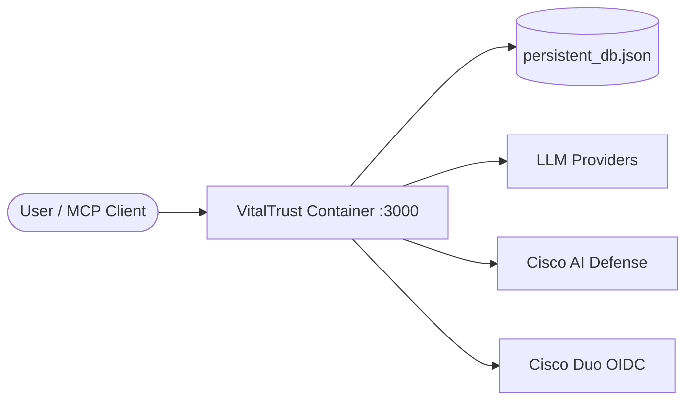
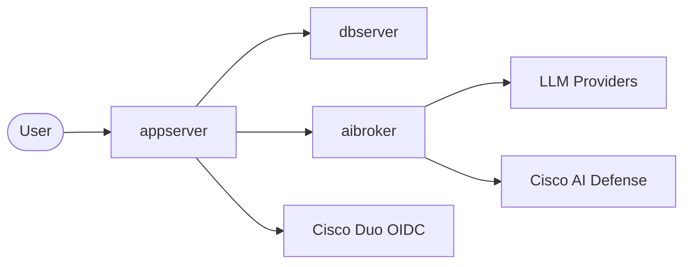

# VitalTrust

**Version:** 3.2.110 · **Release date:** 2026-08-08

VitalTrust is a **mock Electronic Health Record (EHR) portal** built for security architecture labs and Cisco portfolio demonstrations. It looks and behaves like a small healthcare application—patients, clinicians, appointments, billing, messaging, and an AI assistant—but it is **not** a real clinical system and must never be used to store or process actual PHI.

The application is intentionally designed so that **security controls live outside the app** (Cisco Duo, Secure Access, Secure Workload, AI Defense). VitalTrust provides realistic workflows and integration hooks; your lab environment enforces the policies.

---

## Why use VitalTrust?

| Audience | What you get |
|----------|--------------|
| **Security architects** | A believable healthcare workload to map identity, network, workload, and AI guardrails against |
| **Cisco field / partner labs** | Ready-made scenarios for Duo SSO, ZTNA, micro-segmentation, MCP exposure, and AI Defense (API vs Gateway) |
| **Developers learning agentic apps** | MCP tool-calling patterns, role-scoped data access, and multi-node deployment options |

Typical lab goals:

- **Identity:** Duo OIDC sign-in, role mapping (admin / doctor / nurse / patient), step-up MFA for sensitive actions
- **Network:** Restrict who can reach the app or MCP endpoint via Cisco Secure Access (ZTNA)
- **Workload:** Segment traffic between application, database, and AI broker nodes with Cisco Secure Workload
- **AI security:** Compare Cisco AI Defense **Via API** (prompt pre-scan) vs **Defense Gateway** (inline LLM proxy)—including cases where MCP tool results trigger PII blocks

---

## Features

### Clinical portal (demo data)

- Role-based dashboards for **admin**, **doctor**, **nurse**, and **patient**
- Patient roster, vitals, medications, appointments, billing, secure messaging
- Audit logging and admin user management
- Seeded fictional patients and staff (Marvel-themed demo names)

### AI assistant

- In-app chatbot with **Model Context Protocol (MCP) function calling**
- Server-side tools filter data by logged-in user and role (e.g. `get_my_assigned_patients`, `get_user_directory`)
- Supports OpenAI, Groq, Gemini, Claude, and AWS Bedrock
- Optional background agents (chart updater, overnight nurse)

### Security integration hooks

- **Cisco Duo** — OIDC SSO (configure in **Settings → Security Controls → Duo SSO Settings**)
- **Cisco AI Defense** — Via API (Inspect pre-scan) or Defense Gateway (inline proxy)
- **Cisco Secure Access** — Register `/mcp` as an AI Resource for external MCP clients
- **Cisco Secure Workload** — Distributed mode simulates separate app / DB / AI broker hosts for segmentation demos

### Deployment flexibility

- **Standalone** — Single container (default for most labs)
- **Distributed** — Three logical personas: `appserver`, `dbserver`, `aibroker`
- **Multi-tenant training VMs** — Per-user Docker instances on mapped ports (`vt-start`, `vt-status`, `vt-stop`)

---

## Architecture

### Standalone (default)

All UI, REST API, database file, MCP server, and AI orchestration run in one Node/Express process inside a single container.



### Distributed (advanced labs)

Simulates a segmented hospital stack. The application server proxies requests to dedicated database and AI broker nodes.



Configure node roles and peer URLs in **Settings → Deployment**.

---

## Quick start

### Prerequisites

- **Docker** (recommended for labs) or **Node.js 20+** (local development)
- Optional: Cisco Duo, AI Defense, and LLM API credentials

### Option A — One-command Docker deploy (instructor / single VM)

From the project root:

```bash
bash deployment/DeployVitalTrust.sh
```

This builds the `vitaltrust-app` image, resets local runtime artifacts for a fresh seed, and starts the container on port **3000**.

Open: **http://localhost:3000**

### Option B — Per-user training instances (shared lab VM)

After the instructor image is built, each trainee can run:

```bash
vt-start          # Start your instance (port 3000 + digits from username, e.g. aiuser12 → 3012)
vt-status         # Check if running
vt-stop           # Stop your instance
vt-start --reset  # Factory reset — delete container and recreate with default data
```

The shared instructor account (`ubuntu`) uses container `vitaltrust-app` on port **3000**. Other users get isolated containers `vitaltrust-<username>`.

Install the helper scripts on your PATH (once per VM):

```bash
sudo cp deployment/vt-start deployment/vt-status deployment/vt-stop /usr/local/bin/
sudo chmod +x /usr/local/bin/vt-start /usr/local/bin/vt-status /usr/local/bin/vt-stop
```

### Option C — Local development

```bash
npm install
npm run dev        # Starts Express + Vite on port 3000
```

Build for production:

```bash
npm run build
npm start
```

---

## First login

VitalTrust does **not** require a `.env` file to boot.

1. Open the login page.
2. If no default password is configured, you will be prompted to **set the initial admin password** (bootstrap).
3. Sign in as **`admin`** with that password.

Optional: pre-set a password hash in `.env` (see [Configuration](#configuration)) to skip bootstrap.

### Demo accounts

After bootstrap, all seeded local accounts share the same password you configured. Useful usernames:

| Username | Role | Notes |
|----------|------|-------|
| `admin` | Administrator | Full access, Settings, factory reset |
| `doctor1` | Doctor | Gregory House — assigned patients, prescribing |
| `nurse3` | Nurse | Jackie Peyton — bedside workflows, vitals |
| `patient10` | Patient | Steve Rogers — patient portal view |

Use **Sign in with Duo** when Duo SSO is configured (Settings or `.env`).

---

## Configuration

Settings are split between the **web UI** (preferred for labs) and optional **environment variables** (fallback / automation).

### Settings UI (admin)

| Tab | Purpose |
|-----|---------|
| **Deployment** | Standalone vs distributed; peer URLs; connectivity tests |
| **AI Settings** | LLM provider keys, model selection, background agents |
| **Security Controls** | Cisco AI Defense (API / Gateway), Duo SSO credentials |

Non-admin users can **view** settings but cannot save changes.

Browser-stored settings reset automatically when the server container is recreated (fresh deploy), preventing stale AI Defense config from prior installs.

### Optional `.env`

Copy `.env.example` to `.env` if you want server-side defaults at container start:

```bash
cp .env.example .env
```

| Variable | UI alternative | Purpose |
|----------|----------------|---------|
| `DEFAULT_PASSWORD_SHA256` | First-login bootstrap | Pre-set admin password (SHA-256 hex) |
| `DUO_ISSUER_URL`, `DUO_CLIENT_ID`, `DUO_CLIENT_SECRET` | Settings → Duo SSO | Cisco Duo OIDC |
| `OPENAI_API_KEY`, `GEMINI_API_KEY`, `GROQ_API_KEY`, `CLAUDE_API_KEY` | Settings → AI Settings | LLM providers |
| `AWS_REGION`, `AWS_ACCESS_KEY`, `AWS_SECRET_KEY` | Settings → AI Settings | AWS Bedrock |
| `CISCO_AI_DEFENSE_API_KEY` | Settings → Security Controls | AI Defense Inspect API |
| `MCP_ENABLED` | — | Set `false` to disable `/mcp` |
| `MCP_DEMO_USER_ID`, `MCP_DEMO_ROLE` | — | Default identity for MCP probe clients |

**Note:** Do not wrap `.env` values in quotes when using Docker `--env-file`.

Settings saved in the UI **override** environment variables for Duo SSO and take precedence for AI keys stored in browser localStorage during chat sessions.

---

## Cisco security lab scenarios

Detailed deployment notes: [`deployment/README.md`](deployment/README.md)

| Scenario | What to demonstrate | VitalTrust hook |
|----------|---------------------|-----------------|
| **Duo SSO & MFA** | Federated login, step-up for sensitive PHI | Login → Sign in with Duo; configure OIDC in Settings |
| **AI Defense — Via API** | Pre-scan user prompts; LLM traffic direct | Try *"List my patients"* — typically **succeeds** (tool PHI never hits Cisco) |
| **AI Defense — Gateway** | Inline scan of full LLM conversation | Same prompt — often **blocked** when MCP tool JSON with names transits the gateway |
| **Secure Access (ZTNA)** | Control who reaches the app / MCP | Register private IP:3000 as AI Resource; probe `GET /api/mcp/status` |
| **Secure Workload** | East-west segmentation | Deploy distributed mode; allow only appserver → dbserver / aibroker on required ports |

In-app **Documentation** (admin menu) lists MCP tools, sample responses, and security impact notes.

Architecture diagram (draw.io): [`docs/vitaltrust-cisco-security-integrations.drawio`](docs/vitaltrust-cisco-security-integrations.drawio)

---

## MCP endpoint

VitalTrust exposes a **Streamable HTTP MCP server** at:

```
POST /mcp
```

- Tool definitions mirror the in-app AI assistant capabilities (role-scoped).
- Used for Cisco Secure Access **AI Resources** registration and external agent testing.
- Check status: `GET /api/mcp/status`

External clients without identity headers use `MCP_DEMO_USER_ID` / `MCP_DEMO_ROLE` from the environment for lab probes.

---

## Data & persistence

| Artifact | Description |
|----------|-------------|
| `persistent_db.json` | Runtime database (seeded from `src/db.ts` on first run) |
| `deployment_config.json` | Distributed topology settings |
| `duo_sso_config.json` | Duo OIDC credentials saved from Settings |
| `local_auth_config.json` | Bootstrap / local auth state |
| `boot_instance.id` | Detects container recreation to reset browser settings |

**Factory reset** (admin → Settings → Deployment, or `vt-start --reset`) restores baseline demo data.

---

## Development

```bash
npm install          # Install dependencies
npm run dev          # Dev server (tsx + Vite HMR)
npm run build        # Production frontend build
npm run lint         # TypeScript check (tsc --noEmit)
```

### Project layout

```
vitaltrust/
├── src/                    # React frontend, seed data, types
├── server.ts               # Express server, auth, AI chat, routing
├── server-mcp-tools.ts     # MCP tool implementations
├── server-ai-defense.ts    # Cisco AI Defense helpers
├── deployment/             # Dockerfile, deploy scripts, vt-* helpers
├── docs/                   # Architecture diagrams, MCP parity notes
└── duo-sso-config.ts       # Server-side Duo credential persistence
```

### Key endpoints

| Endpoint | Description |
|----------|-------------|
| `POST /api/auth/login` | Local username/password login |
| `GET /api/auth/duo/url` | Start Duo OIDC flow |
| `POST /api/ai/chat` | AI assistant (MCP tool loop) |
| `POST /mcp` | External MCP (Streamable HTTP) |
| `GET /api/system/config` | Deployment mode and topology |

---

## Troubleshooting

| Issue | Check |
|-------|-------|
| Stale AI Defense settings after redeploy | Hard refresh browser; redeploy clears localStorage via boot instance sync |
| Duo login fails | Settings → Duo SSO → Test; verify redirect URI matches your public URL |
| Gateway mode blocks patient list | Expected — tool JSON with names is inline-scanned; use API mode to compare |
| `vt-start` — image not found | Instructor must run `DeployVitalTrust.sh` first |
| Port conflict on training VM | Username digits map to port `3000 + N`; instructor `ubuntu` uses 3000 |

---

## Additional documentation

- [`AGENTS.md`](AGENTS.md) — Project conventions for contributors and AI assistants
- [`deployment/README.md`](deployment/README.md) — Docker and distributed deployment
- [`docs/MCP-UI-PARITY.md`](docs/MCP-UI-PARITY.md) — MCP tool vs UI feature matrix
- [`.env.example`](.env.example) — Optional environment variables

---

## License

Apache License 2.0 — see [`LICENSE`](LICENSE).

---

## Disclaimer

VitalTrust is a **demonstration application only**. It must not be deployed as a production EHR, must not hold real patient data, and does not implement production-grade security controls internally—those belong in your Cisco lab infrastructure surrounding the app.
